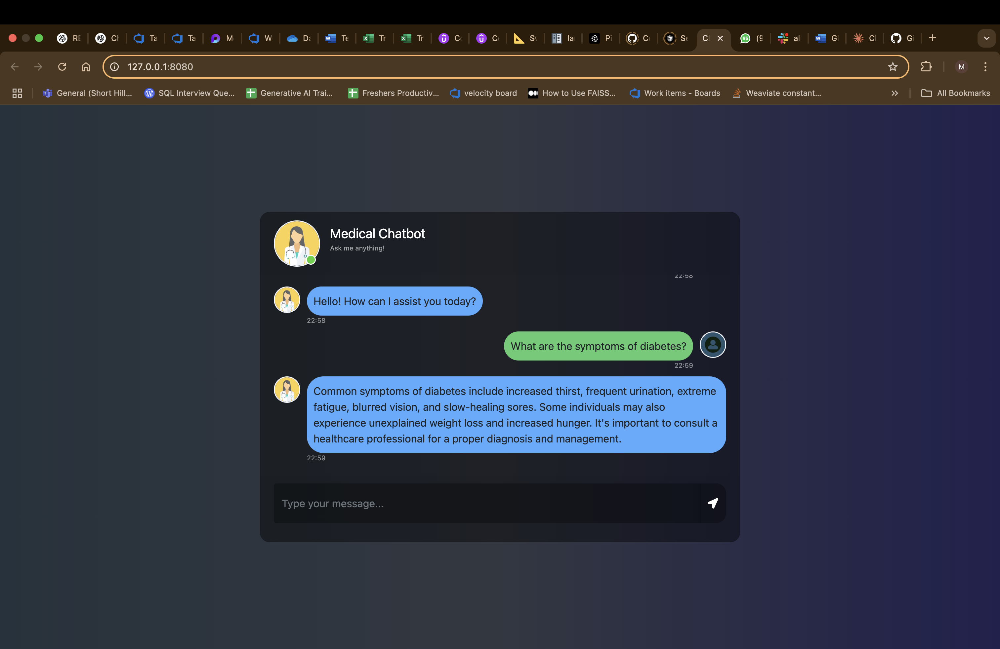

# Medical Chatbot using Generative AI

## Overview
This project implements a medical chatbot leveraging Generative AI technologies. It utilizes **LangChain, OpenAI APIs, Pinecone, and Flask** to build an intelligent conversational agent capable of handling medical-related queries.

## Features
- Natural language understanding and response generation
- Retrieval-augmented generation (RAG) using Pinecone
- Integration with OpenAI LLMs
- Flask-based API for easy deployment
- PDF processing for extracting medical knowledge

## Installation and Setup

### 1. Clone the Repository
```bash
git clone https://github.com/ManpreetShorthillsAI/medicalbot.git
cd medicalbot
```

### 2. Create a Virtual Environment
We recommend using **Conda** for managing dependencies.
```bash
python3 -m venv medicalbotenv
source medicalbotenv/bin/activate
```

### 3. Install Dependencies
```bash
pip install -r requirements.txt
```

### 4. Set Up Environment Variables
Create a `.env` file in the root directory and add your Pinecone & OpenAI credentials as follows:
```ini
PINECONE_API_KEY=your_pinecone_api_key
PINECONE_ENV=your_pinecone_environment
OPENAI_API_KEY=your_openai_api_key
```

## Running the Application
Start the Flask server:
```bash
python3 app.py
```
The API should now be accessible at `http://127.0.0.1:8080/`.

## Screenshot



## Usage
- Send requests to the API endpoint to interact with the chatbot.
- Upload medical documents for improved chatbot responses.


